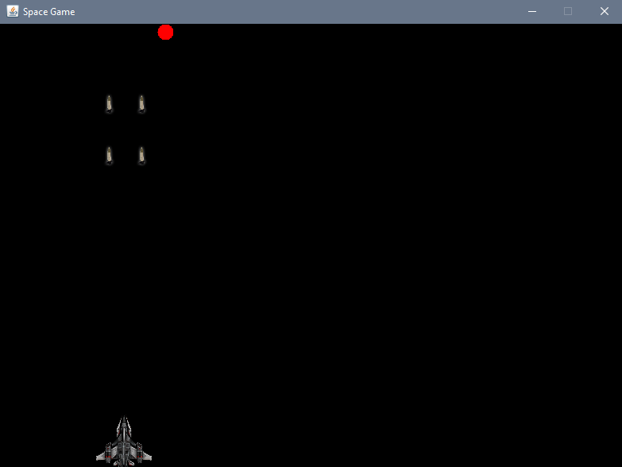
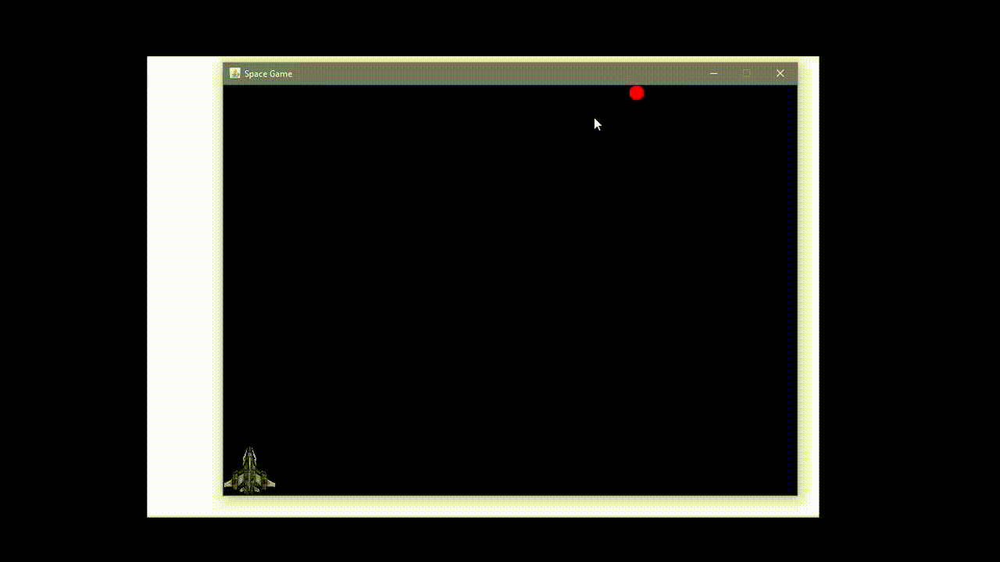

# Space Game

> Simple Space Game created with Java Swing

[](https://www.java.com/tr/)
[](https://docs.oracle.com/javase/7/docs/api/javax/swing/package-summary.html)
[](https://maven.apache.org/guides/)

## Installation

You can download the JAR file\spacegame-1.0-SNAPSHOT.jar file. But careful you must download with *.png files. Then you can run via just clicking or in Windows, you can run via cmd:

``` java -jar spacegame-1.0-SNAPSHOT.jar```

## Usage Example

When you run the jar file , you will the game screen.



Then you can move the spaceship with the `arrow keys` and shoot with the `space` key. If you can hit the target it's game over and you win.



Have a nice try!

If you run into a problem, you can let me know here or on my Twitter account. - [@Mehmetkaragoz07](https://twitter.com/Mehmetkaragoz07) - karagoz.mhmtg@gmail.com

https://github.com/mehmet-karagoz
